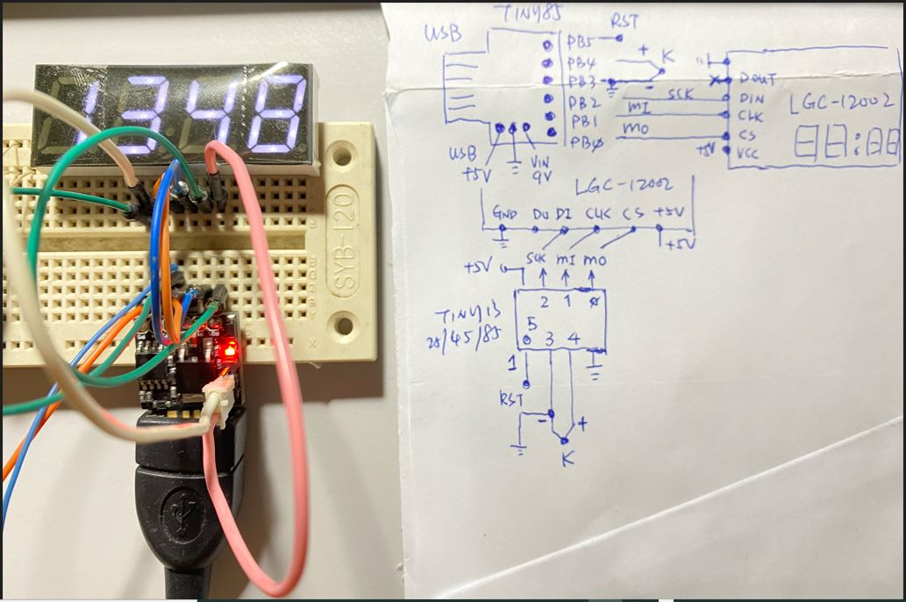

# AVR_Attiny_Thermocouple
copy and play with the design idea, http://www.technoblogy.com/show?2G9S, Tiny Thermocouple Thermometer base on Attiny85 or similar.  
project folder [Attiny85_KTT](Attiny85_KTT)  
the MCU used https://github.com/xiaolaba/AVR_Attiny85_micronucleus_2.x_blink  



### the code and why  
it is likely the same technique used with [transistor tracer](https://github.com/xiaolaba/Curve_Tracer_testing)  
but there is telling why, see tutorial/application note about over sampling if wanna dive deeper.  
```
  // over sampling technique, 
  // sum 4^n and then devide 2^n, get one more bit of ADC resolution, and inherent a FIR filter does, but it is slow,
  // n = 2 in this case,
  for (int i=0; i<16; i++) reading = reading + ReadThermocouple();   // over sampling 4^2 = 16
  reading = Convert(max((reading>>2) + ADCOffset*4, 0));   // result / 2^2 = result >>2

```


the code and original design, licensed, however, GitHub only show something but not exactly, so uses the license as it is for this experiment and log, all credit & willing is subject to cite with the following,

```
/* Tiny Thermocouple Thermometer

   David Johnson-Davies - www.technoblogy.com - 5th March 2019
   ATtiny85 @ 1 MHz (internal oscillator; BOD disabled)
   
   CC BY 4.0
   Licensed under a Creative Commons Attribution 4.0 International license: 
   http://creativecommons.org/licenses/by/4.0/
*/
```

no uses the OLED, but try to be with LCD 1602 that is available and around with us.  
cut OLED code, change MCU to Attiny25, dummy code for compilaton

code size
```
// ATtiny25_K_Type_Thermocouple.ino
// ATtiny25_KTT.ino
// original copy, cut OLED related code
// try and use Attiny25
// Sketch uses 1678 bytes (81%) of program storage space. Maximum is 2048 bytes.
// Global variables use 57 bytes (44%) of dynamic memory, leaving 71 bytes for local variables. Maximum is 128 bytes.
```
